# CoCo Platform — Deep Architecture Analysis

> Generated 2026-04-08 | 3 parallel analyst agents | Backend + Frontend + Data Layer

---

## 0. User Journeys

### Primary Daily Flow

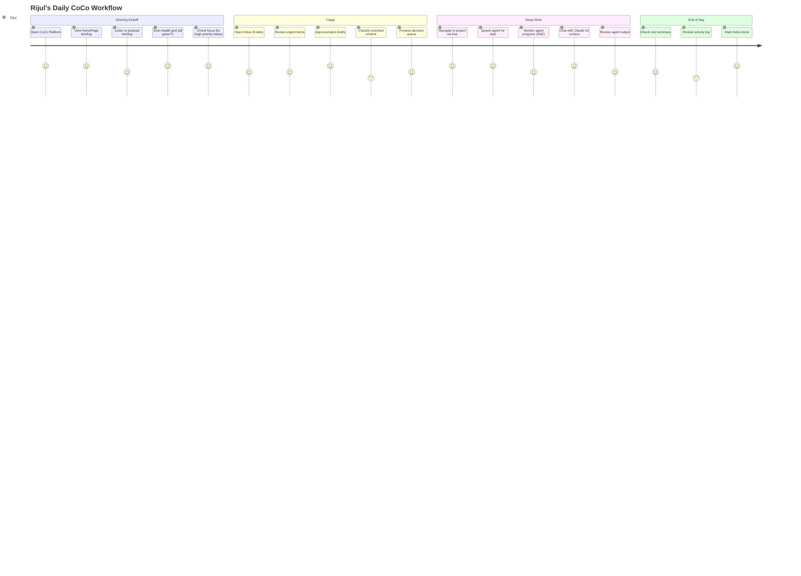

### Journey: Inbox Triage to Action

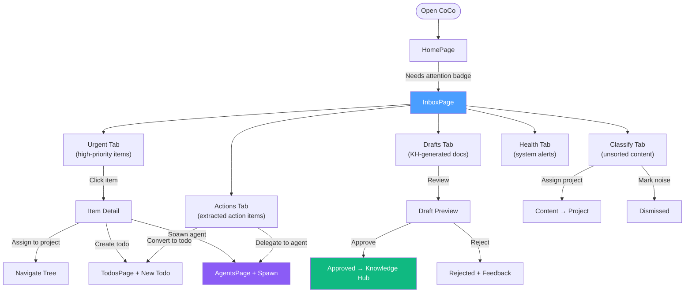

### Journey: Spawning & Monitoring an Agent

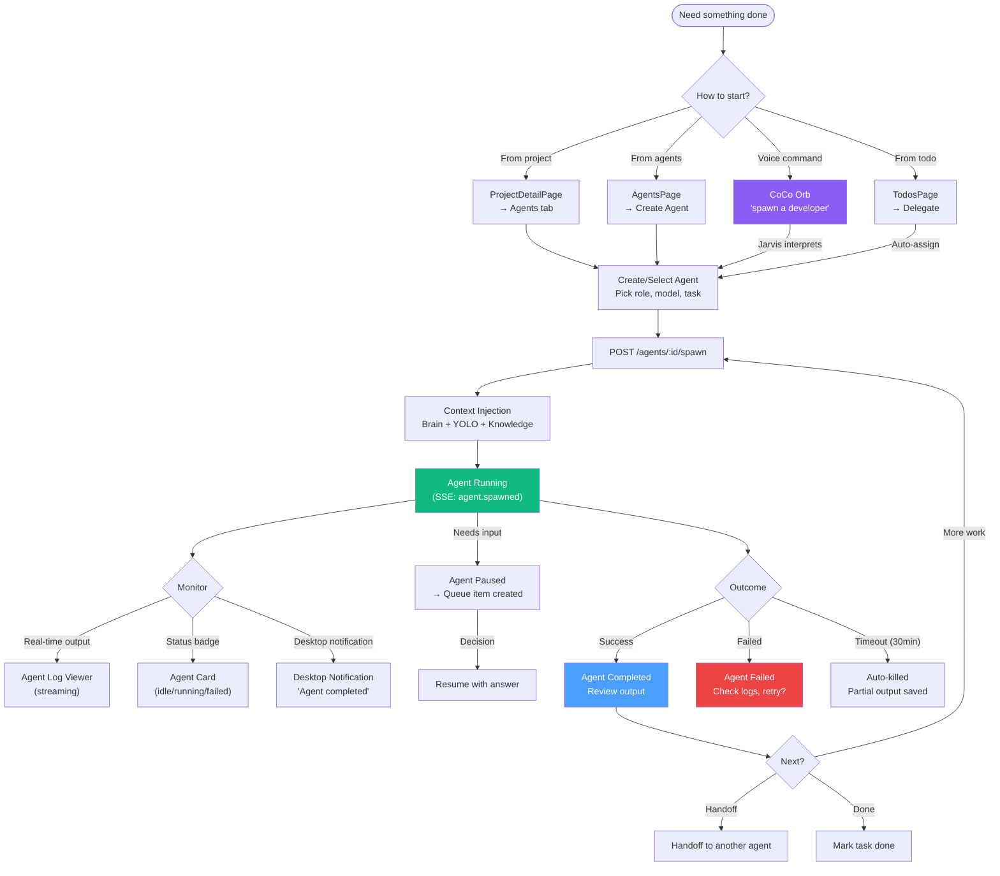

### Journey: Knowledge Discovery

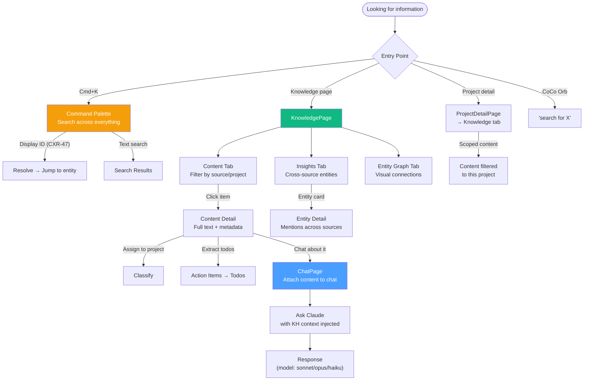

### Journey: Self-Improve Cycle (Studio)

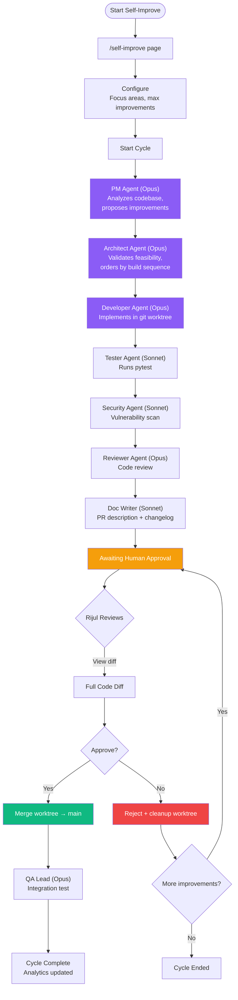

### Journey: Portfolio Management (Tree)

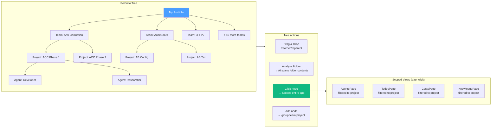

---

## 1. System Architecture Overview

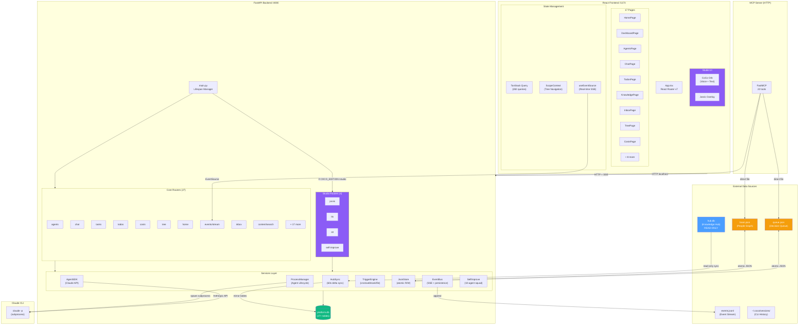

---

## 2. Agent Lifecycle Flow

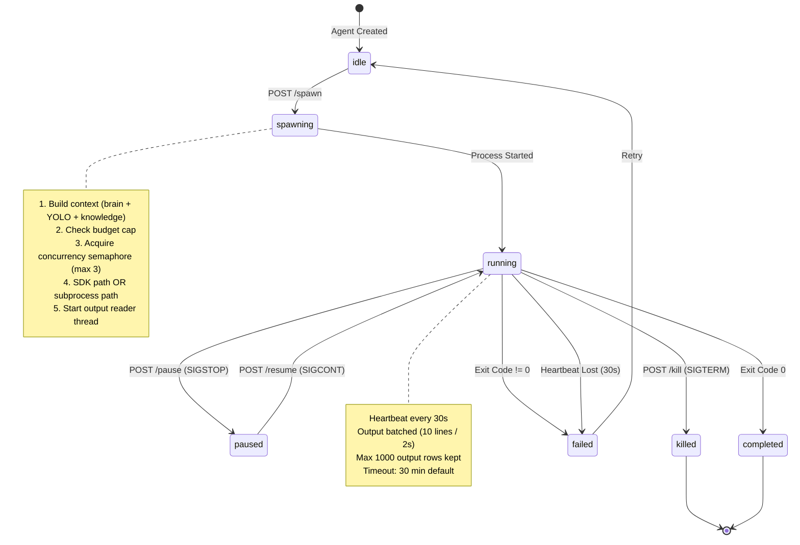

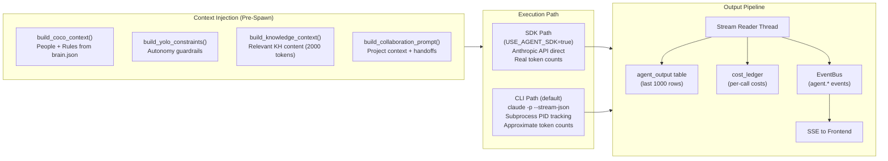

---

## 3. Data Flow: Knowledge Hub to Frontend

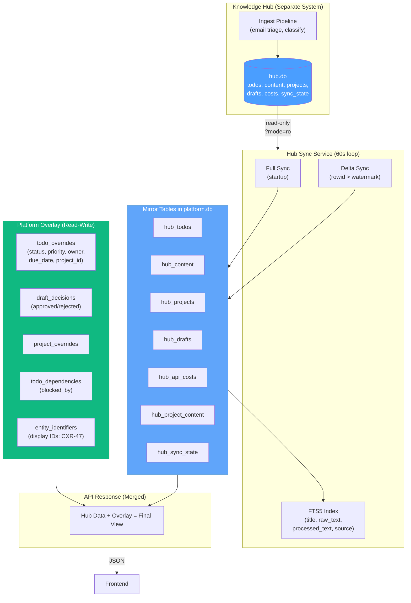

---

## 4. Real-Time Event System

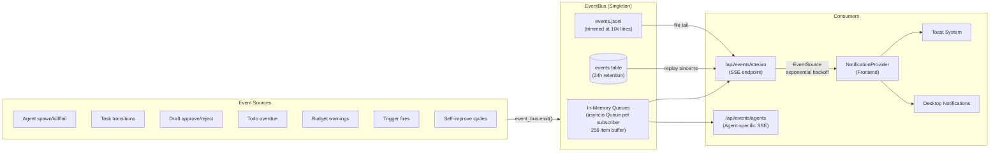

---

## 5. Self-Improve Cycle (Studio)

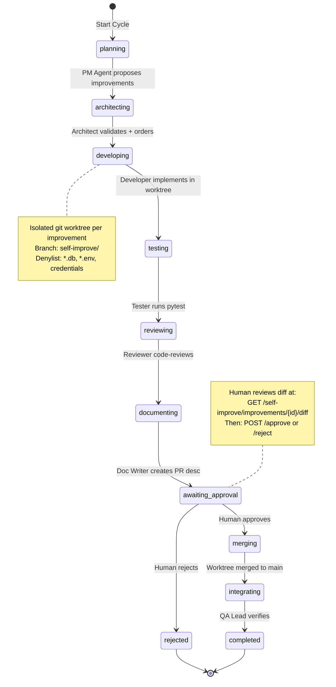

---

## 6. Frontend Page Architecture

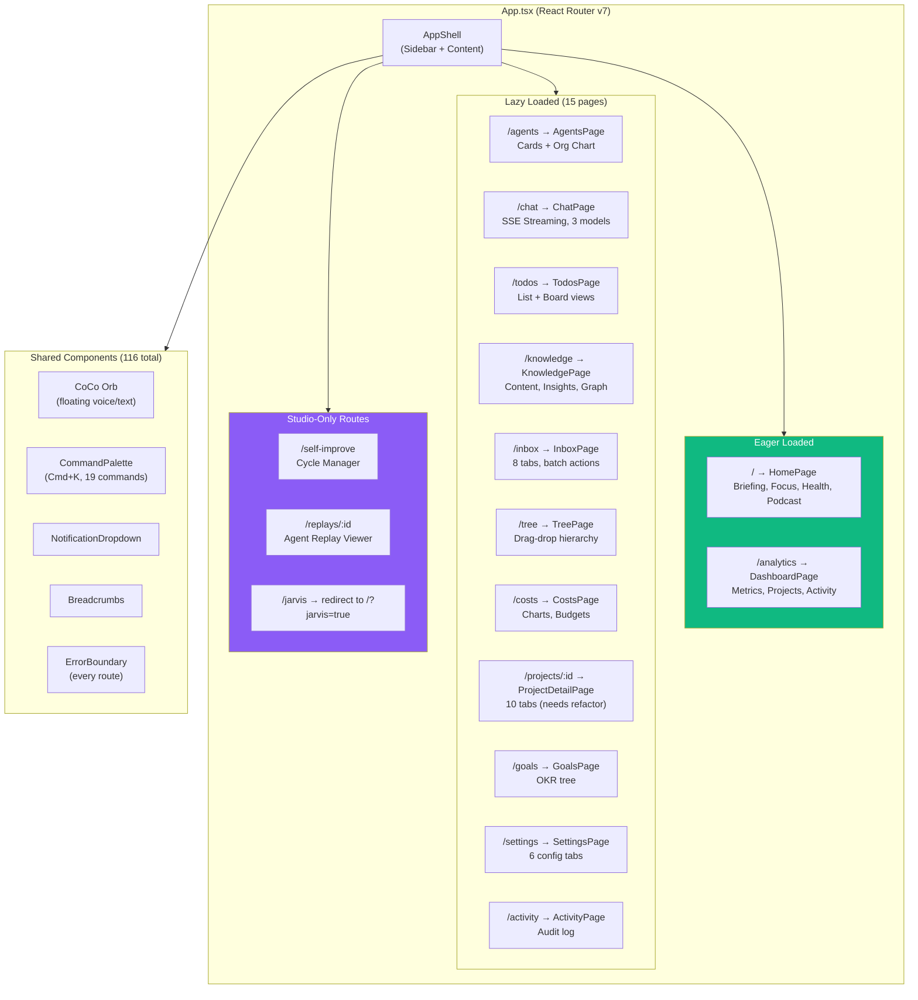

---

## 7. Database Schema Map

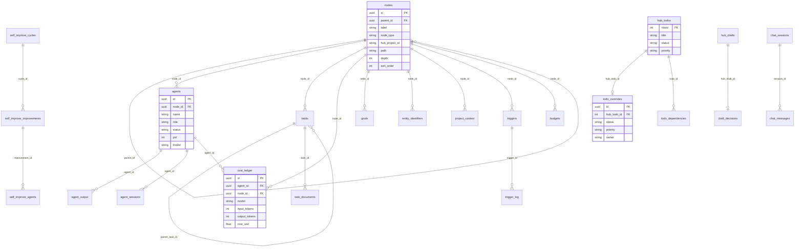

---

## 8. Trigger Execution Flow

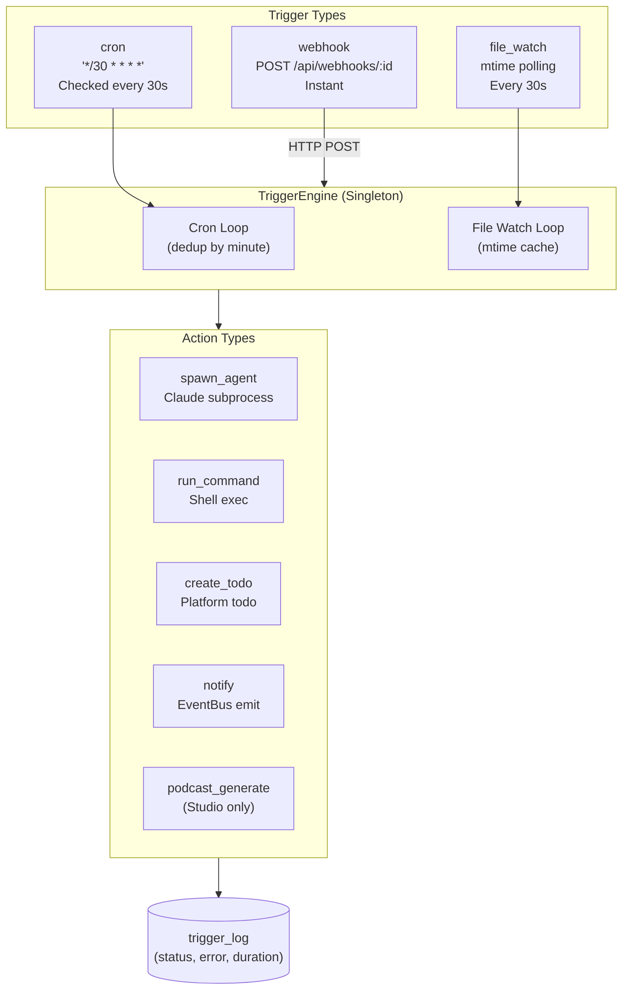

---

## 9. Health Scorecard

### What Works Well

| Area | Score | Details |
|------|-------|---------|
| **Hub Sync** | 9/10 | Read-only mirror with delta sync, FTS5 index, overlay pattern. Rock solid. |
| **Agent Spawning** | 8/10 | Context injection, budget checks, heartbeat monitoring, concurrency control. |
| **Event System** | 8/10 | Dual persistence (memory + DB), SSE with replay, exponential backoff reconnect. |
| **Tree Hierarchy** | 8/10 | Proper FK constraints, path indexing, depth tracking. Flexible. |
| **Trigger Engine** | 8/10 | Cron + webhook + file-watch, comprehensive logging. |
| **MCP Server** | 9/10 | HTTP-based (no imports), graceful degradation, local file fallback. |
| **Frontend Routing** | 8/10 | Clean lazy loading, ErrorBoundary on every route, edition gating. |
| **SSE Reconnection** | 9/10 | Exponential backoff + jitter + event replay. Production-ready. |
| **Command Palette** | 8/10 | 19 commands, keyboard nav, dynamic search, display ID resolve. |
| **Cost Tracking** | 7/10 | Dual ledger, budget enforcement, per-model breakdown. |
| **Bootstrap/Setup** | 8/10 | Idempotent init, clean scripts, proper env handling. |
| **Todo System** | 7/10 | Hub mirror + overlay + dependencies + display IDs. |

### What Needs Work

| Area | Score | Issue | Recommendation |
|------|-------|-------|----------------|
| **brain.json** | 4/10 | Single JSON file, no transactions, concurrent write risk | Migrate to `people` + `attention_rules` tables in platform.db |
| **queue.json** | 3/10 | Index-based access, brittle, no UUID keys | Migrate to `queue_items` table with UUID PKs |
| **Token Counting** | 5/10 | SDK = real tokens, CLI = word-count estimate. Costs diverge. | Standardize on SDK path or parse CLI output for actual tokens |
| **Alembic Migrations** | 3/10 | Only baseline exists. Schema changes are manual. | Create migration per schema change going forward |
| **ProjectDetailPage** | 4/10 | 1000+ LOC, 10 tabs, all rendered in DOM | Split into sub-components, lazy-load tabs |
| **Chat Recovery** | 4/10 | SSE close mid-stream = lost content, no retry | Save partial response, add retry button |
| **List Virtualization** | 4/10 | ContentList, TodoList, ActivityFeed render all items | Add @tanstack/react-virtual |
| **Memoization** | 5/10 | Only 51/116 components memoized. Jarvis overlay not memoized. | Memoize expensive components, especially Jarvis + Chat |
| **Error Handling** | 5/10 | ScopeContext silent on /tree failure, Inbox classify fails silently | Add error states + fallback UI everywhere |
| **useAgentSSE** | 4/10 | Redundant with useEventSource, manual EventSource parsing | Consolidate into single SSE hook |
| **Offline/Failure UX** | 4/10 | No warning when SSE disconnects (except small banner) | Add prominent offline indicator + graceful degradation |
| **Form Validation** | 4/10 | CreateAgentDialog, AddTodoDialog lack input validation | Add validation (zod + react-hook-form or similar) |

### Dead/Unused Code

| Item | Location | Status |
|------|----------|--------|
| `/people` route in CommandPalette | No PeoplePage exists | Dead reference |
| `/tasks` route in CommandPalette | No TasksPage exists | Dead reference |
| `ReplayList` component | ReplayPage uses iframe only | Unused |
| `useCardActions` hook | Trivially simple | Inline candidate |
| Zustand in package.json | Not imported anywhere | Unused dependency |

---

## 10. Full System Sequence: User Creates Agent

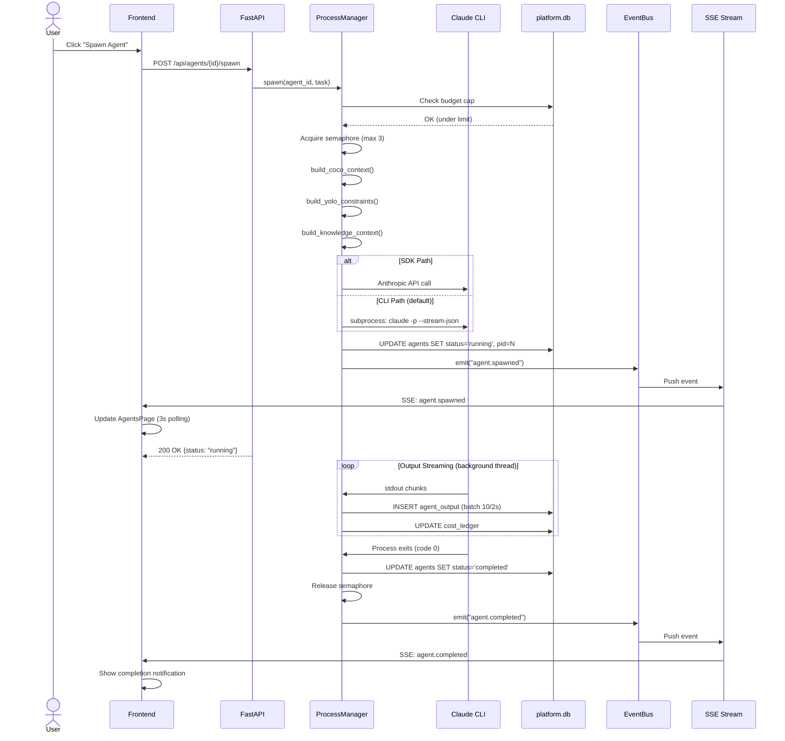

---

## 11. Recommended Priority Fixes

### P0 (Data Integrity)
1. **Migrate brain.json to platform.db** — concurrent writes can corrupt
2. **Migrate queue.json to platform.db** — index-based access is a bug waiting to happen
3. **Add Alembic migration workflow** — schema changes need version control

### P1 (UX Quality)
4. **Virtualize long lists** — ContentList, TodoList, ActivityFeed
5. **Split ProjectDetailPage** — 10 tabs in 1000+ LOC is unmaintainable
6. **Add chat stream recovery** — partial content loss on disconnect
7. **Consolidate SSE hooks** — useAgentSSE is redundant

### P2 (Reliability)
8. **Standardize token counting** — SDK vs CLI divergence under-reports costs
9. **Add form validation** — agent creation, todo creation have no input checks
10. **Improve offline UX** — prominent disconnection indicator
11. **Memoize Jarvis + Chat** — expensive re-renders on every state change

### P3 (Cleanup)
12. **Remove dead CommandPalette routes** — /people, /tasks pages don't exist
13. **Remove unused Zustand dependency**
14. **Inline useCardActions hook**
