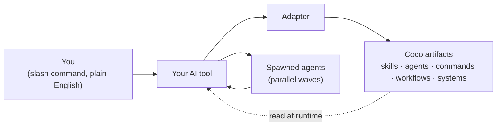

<div align="center">

<br>


# Coco is now superintelligent.

### <sub>A board of the world's top minds — Karpathy, Hinton, +180 more — wherever your AI lives.</sub><br>Free. MIT. 90 seconds.

<br>

[](https://opensource.org/license/mit)
[](CHANGELOG.md)
[](skills/)
[](https://github.com/rkz91/coco/actions)
[](https://github.com/rkz91/coco)

<br>

<p>
&nbsp;&nbsp;<a href="#install"><kbd> &nbsp; Install &nbsp; </kbd></a>&nbsp;&nbsp;
<a href="#three-pillars"><kbd> &nbsp; What it does &nbsp; </kbd></a>&nbsp;&nbsp;
<a href="#see-it-run"><kbd> &nbsp; Demos &nbsp; </kbd></a>&nbsp;&nbsp;
<a href="#built-on"><kbd> &nbsp; Built on &nbsp; </kbd></a>&nbsp;&nbsp;
<a href="docs/architecture.md"><kbd> &nbsp; Architecture &nbsp; </kbd></a>
</p>

<br>

</div>

---

<div align="center">

> **One coder typing prompts? That was last year.**
>
> Coco turns your AI tool into a team. Multiple agents. Working in parallel.<br>
> State that survives. Verification before "done." Free. MIT. Yours.

</div>

```bash
git clone https://github.com/rkz91/coco.git && cd coco && bash install.sh
```

<div align="center"><sub>90 seconds. That's the whole onboarding.</sub></div>

---

## What you get

<div align="center">

<sub>USER-INVOKABLE</sub>

<h1>94</h1>

<sub>things you can invoke right after install</sub>

</div>

<table align="center">
<tr>
<td align="center" width="14%"><h3>59</h3><sub>Skills</sub></td>
<td align="center" width="14%"><h3>35</h3><sub>Commands</sub></td>
<td align="center" width="14%"><h3>10</h3><sub>Agents</sub><br><sub><sub>(spawned)</sub></sub></td>
<td align="center" width="14%"><h3>4</h3><sub>Systems</sub></td>
<td align="center" width="14%"><h3>4</h3><sub>Adapters</sub></td>
<td align="center" width="14%"><h3>15</h3><sub>Rules</sub></td>
<td align="center" width="16%"><h3>$0</h3><sub>Forever</sub></td>
</tr>
</table>

<div align="center">

<sub>Plus opt-in bundles: <strong>+68 GSD skills</strong> · <strong>+24 GSD agents</strong> · <strong>+6 Brain skills</strong> · Team multi-agent pipelines · <strong>+185 Superintelligence personas</strong> (3 teams, 75 commands)</sub>

</div>

---

## Three pillars

<table>
<tr>
<td width="33%" valign="top">

### A team. <br>Not a single coder.

`/team:ship` runs **6 build stages + 7 hard verification gates** with role-appropriate agents. Research → Architect → Plan → Review → Build — then every test/lint/coverage claim must clear an evidence gate (skip ≠ pass, independent re-run) before a PR opens. You approve once; the team can't report fake green.

</td>
<td width="33%" valign="top">

### State that <br>survives anything.

Most AI sessions die on `/clear`. Coco doesn't. **68 orchestration skills** with disk-backed phase state. Atomic commits per step. Roll back any decision. Resume from any checkpoint.

</td>
<td width="33%" valign="top">

### One install. <br>Any AI tool.

Pure markdown + frontmatter. Adapters wire into Claude Code, Cursor, Codex, or any [AGENTS.md](https://agents.md/) tool. **Switch tools in 6 months — your skills follow.**

</td>
</tr>
</table>

---

## YOLO mode

<table>
<tr>
<td valign="top">

```bash
/coco yolo
```

</td>
<td valign="top">

**Skip the approval gates. Let Coco run.**<br>
<sub>Activates autonomous mode. Multi-stage pipelines complete end-to-end without asking permission between phases. Combine with <code>/gsd-autonomous</code> and <code>--systems gsd</code> to run an entire roadmap unattended. Toggle off with <code>/coco careful</code> or <code>/coco normal</code>.</sub>

</td>
</tr>
</table>

<sub><strong>Use it when:</strong> You trust the plan and want to walk away. Long debug runs. Overnight builds. Multi-phase migrations. Atomic commits give you a paper trail and full reversibility — even with autonomy on.</sub>

---

## Before Coco vs After Coco

<table>
<tr>
<th width="22%">You ask</th>
<th width="36%">Plain Claude Code / Cursor / Codex / Antigravity does</th>
<th width="42%">Coco-powered AI does</th>
</tr>
<tr>
<td><strong>"Build a habit tracker"</strong></td>
<td>Generates one component, gets confused on routing, you guide it for 4 hours</td>
<td>Researches the space, picks a stack, plans 5 phases, runs 4 build agents in parallel, verifies, ships — you watch</td>
</tr>
<tr>
<td><strong>"Audit this code"</strong></td>
<td>"Looks fine!"</td>
<td>7-category audit: TDZ errors, import mismatches, broken refs, dead code, mock leakage, CSS regressions, React anti-patterns</td>
</tr>
<tr>
<td><strong>"Debug this"</strong></td>
<td>"Have you tried turning it off and on?"</td>
<td>Reproduces → isolates → diagnoses root → fixes → verifies, with checkpoints at every step</td>
</tr>
<tr>
<td><strong>"Clone this design"</strong></td>
<td>Generic Tailwind blob</td>
<td>Pixel-perfect single-file HTML with all design tokens extracted, opens in any browser</td>
</tr>
<tr>
<td><strong>"Write a spec"</strong></td>
<td>200 words, mostly fluff</td>
<td>13-section PRD with user stories, success metrics, risks, open questions</td>
</tr>
<tr>
<td><strong>Context resets</strong></td>
<td>Start over from scratch</td>
<td>Resume exactly where you left off — phases, decisions, tasks all persisted</td>
</tr>
</table>

---

## See it run

<table>
<tr>
<td width="50%" valign="top">

### Reverse-engineer any site

```bash
/clone-website https://stripe.com
```

> Single-file HTML. All design tokens extracted (colors, typography, spacing, shadows, radii). No build system. Opens in any browser.

</td>
<td width="50%" valign="top">

### Catch AI-introduced bugs

```bash
/code-verification
```

> 7-category audit on freshly-generated code. Saves 30+ minutes of debugging per session.

</td>
</tr>
<tr>
<td valign="top">

### Debug autonomously

```bash
/systematic-debugging
```

> Reproduce → isolate → diagnose → fix. Checkpoints at each step. Resume after context reset. Walk away. Come back to a fixed bug.

</td>
<td valign="top">

### Generate a PRD in 30 seconds

```bash
/prd-generator
```

> 13 sections: problem, users, requirements, stories, success metrics, risks, timeline, open questions.

</td>
</tr>
<tr>
<td valign="top">

### Design like Apple, not generic AI

```bash
/ui-ux-pro-max
```

> 50 styles. 21 palettes. 50 font pairings. 20 chart types. Opinionated picks per domain.

</td>
<td valign="top">

### Build a personal AI brain

```bash
bash install.sh --systems brain
/brain-init && /brain-update
```

> Local SQLite. Auto-extracts entities, decisions, threads. Wikipedia articles per entity. Yours forever.

</td>
</tr>
</table>

---

## Superintelligence — a board of world-class minds

```bash
/SI-AI-Decide "should we switch our vector store to pgvector?"
/SI-Eng-Pre-Mortem "our zero-downtime migration plan"
/SI-PD-Roast "this onboarding flow"
```

> Convene a panel of **185 named experts** across three teams — **AI** (59), **Engineering** (70), **Product & Design** (56) — and get a decision, tradeoff table, pre-mortem, or roast with **per-line attribution** to a specific person. The orchestrator scores every persona by domain-match + cell-coverage + productive-conflict pairing and picks the sharpest 16–32 for your prompt.
>
> Each persona is synthesized from public sources with cited evidence — illustrative expert lenses, not official statements (see the bundle's [`DISCLAIMER.md`](systems/superintelligence/DISCLAIMER.md)). Opt-in: `install.sh --systems superintelligence` generates the 75 `/SI-*` commands from the shipped registries.

---

## Power features

<table>
<tr>
<td width="50%" valign="top">

### CoCo router

```bash
/coco
```

> Conversational dashboard wrapping every skill, command, and system. Routes "what's blocking?", "draft a status update", "tell me about Stripe" to the right artifact automatically. Time-aware. Remembers your last session.

</td>
<td width="50%" valign="top">

### Multimodal memory

```bash
/media-memory
```

> Ingest, embed, and search across images, video, audio, and documents. Gemini Embedding 2 + ChromaDB. Auto-logs anything you generate or share. Auto-queries when you reference past media.

</td>
</tr>
<tr>
<td valign="top">

### Recurring + scheduled agents

```bash
/schedule run /audit-prs every Monday
/loop 5m /watch-deploy
```

> Cron-style remote routines plus interval loops. Send an agent to triage your queue, watch a deploy, follow up on a flag — without you sitting there.

</td>
<td valign="top">

### Email triage suite

```bash
/email:summary
/email:today
/email:reply <subject>
/email:search <keywords>
/email:thread <subject>
```

> Daily summary, today's mail, drafted replies, threading, search, save-to-folder. Reads your real Outlook — auto-detects Legacy (AppleScript) vs New Outlook (MIME/HxStore extraction).

</td>
</tr>
<tr>
<td valign="top">

### Workstreams (parallel branches)

```bash
/gsd-workstreams create feature-x
/gsd-workstreams switch feature-y
```

> Run multiple parallel branches of work in the same project. Each workstream tracks its own state, plan, and progress.

</td>
<td valign="top">

### Workspaces (isolated copies)

```bash
/gsd-new-workspace
```

> Create a sandboxed copy of the repo with independent <code>.planning/</code>. Try a refactor without polluting your main workspace.

</td>
</tr>
<tr>
<td valign="top">

### Hookify (prevent bad behavior)

```bash
/hookify
```

> Create hooks that block unwanted AI behavior — based on conversation analysis or explicit rules. Stops your AI from running <code>git push --force</code> at 3am.

</td>
<td valign="top">

### AGENTS.md export

```bash
bash adapters/codex/install.sh
```

> Compiles every skill, command, agent, and rule into a single <a href="https://agents.md/">AGENTS.md</a>. Drop into any project. Codex, Aider, Continue, Windsurf, Cline pick it up automatically. In Codex this is prompt context, not necessarily a visible slash-command palette.

</td>
</tr>
<tr>
<td valign="top">

### Forensics (post-mortem)

```bash
/gsd-forensics
```

> When a phase fails, analyze git history, artifacts, and state to diagnose what went wrong. Auto-generates a structured forensic report.

</td>
<td valign="top">

### Caveman mode

```
/caveman full
```

> Compress AI output ~75% by speaking like caveman while keeping technical accuracy. Saves tokens. Useful for long sessions.

</td>
</tr>
<tr>
<td valign="top">

### Multi-agent dispatching

```bash
/dispatching-parallel-agents
```

> 4 patterns for orchestrating agents: single-wave (independent), multi-wave (sequential), shared-files (handoff via disk), resume-chains (deep iteration). Picks the right one for the task automatically.

</td>
<td valign="top">

### Verification gates

```bash
/verification-before-completion
/code-verification
```

> Before claiming "done," Coco runs verification: build, lint, imports, references, tests, behavior. Auto-blocks "looks good!" output without proof. `/team` pipelines add a **Test Evidence Protocol** — every test/lint/coverage claim needs a captured command + output (skip ≠ pass) or it's stripped and the PR blocked.

</td>
</tr>
</table>

---

## How it works



<div align="center">

<sub>One source of truth. Adapters handle IDE specifics. Skills run multi-agent waves when needed.</sub>

</div>

Architecture deep-dive: [`docs/architecture.md`](docs/architecture.md).

---

## Install

<table>
<tr>
<td width="50%" valign="top">

**Standard (90 seconds)**

```bash
git clone https://github.com/rkz91/coco.git
cd coco
bash install.sh
```

Auto-detects your AI tool.

</td>
<td width="50%" valign="top">

**Via npm (GitHub Packages)**

```bash
# one-time auth
echo "@rkz91:registry=https://npm.pkg.github.com" >> ~/.npmrc
echo "//npm.pkg.github.com/:_authToken=YOUR_GH_TOKEN" >> ~/.npmrc

# install
npm install -g @rkz91/coco-cli
coco
```

[Token: `read:packages` scope](https://github.com/settings/tokens). [Full guide](docs/distribution/npm-github-packages.md).

</td>
</tr>
<tr>
<td valign="top">

**With orchestration bundles**

```bash
bash install.sh --systems gsd,brain,team
```

+68 GSD skills · +24 GSD agents · +6 brain skills · +Team pipelines.

</td>
<td valign="top">

**Update later**

```bash
# git clone install
cd coco && git pull && bash install.sh

# npm install
npm update -g @rkz91/coco-cli
```

</td>
</tr>
<tr>
<td valign="top">

**Adapter override**

```bash
bash install.sh --adapter claude-code
bash install.sh --adapter cursor
bash install.sh --adapter codex
bash install.sh --adapter generic
```

</td>
<td valign="top">

**Uninstall (clean — symlinks only)**

```bash
find ~/.claude ~/.cursor -type l \
  -lname "*$(pwd)*" -delete
```

</td>
</tr>
</table>

---

## Compatible AI tools

<table>
<tr>
<th>Tool</th><th>Adapter</th><th>Status</th>
</tr>
<tr><td><a href="https://docs.anthropic.com/en/docs/claude-code">Claude Code</a></td><td><code>claude-code</code></td><td>stable</td></tr>
<tr><td><a href="https://cursor.com/">Cursor</a></td><td><code>cursor</code></td><td>stable</td></tr>
<tr><td><a href="https://github.com/openai/codex">Codex CLI</a></td><td><code>codex</code></td><td>stable</td></tr>
<tr><td>Aider, Continue, Windsurf, Cline (anything reading <a href="https://agents.md/">AGENTS.md</a>)</td><td><code>generic</code></td><td>stable</td></tr>
<tr><td>VS Code (via Continue)</td><td><code>vscode-continue</code></td><td><sub>v0.2 planned</sub></td></tr>
<tr><td>Antigravity (Google)</td><td><code>antigravity</code></td><td><sub>v0.2 planned</sub></td></tr>
</table>

---

## Built on

<sub>Coco stands on the shoulders of these open-source frameworks. Special thanks to their authors and contributors.</sub>

<table>
<tr>
<th width="20%">Project</th><th width="20%">Author</th><th>What it gave Coco</th>
</tr>
<tr>
<td><a href="https://github.com/obra/superpowers"><strong>obra/superpowers</strong></a></td>
<td>Jesse Vincent (<a href="https://github.com/obra">@obra</a>)</td>
<td>The 15 foundational skills — <code>brainstorming</code>, <code>systematic-debugging</code>, <code>test-driven-development</code>, <code>verification-before-completion</code>, <code>dispatching-parallel-agents</code>, and more. The methodology that makes AI agents <em>systematic</em> instead of reactive.</td>
</tr>
<tr>
<td><a href="https://github.com/gsd-build/get-shit-done"><strong>gsd-build/get-shit-done</strong></a></td>
<td>TÂCHES</td>
<td>The 68-skill GSD project orchestration framework. Phases, atomic commits, parallel agent waves, verification gates, state persistence.</td>
</tr>
<tr>
<td><a href="https://github.com/JCodesMore/ai-website-cloner-template"><strong>JCodesMore/ai-website-cloner-template</strong></a></td>
<td><a href="https://github.com/JCodesMore">@JCodesMore</a></td>
<td>The website cloning approach behind <code>/clone-website</code>.</td>
</tr>
<tr>
<td><a href="https://docs.anthropic.com/en/docs/build-with-claude/skills"><strong>Anthropic Skills spec</strong></a></td>
<td>Anthropic</td>
<td>The Skill format (frontmatter + markdown body) and discovery pattern.</td>
</tr>
<tr>
<td><a href="https://agents.md/"><strong>agents.md</strong></a></td>
<td>community</td>
<td>The vendor-neutral spec that makes Coco's <code>generic</code> adapter possible across Aider, Continue, Windsurf, Cline, and Codex.</td>
</tr>
<tr>
<td><a href="https://docs.anthropic.com/en/docs/claude-code"><strong>Anthropic Claude Code</strong></a></td>
<td>Anthropic</td>
<td>The first-class invocation model for skills, commands, and agents.</td>
</tr>
<tr>
<td><a href="https://cursor.com/"><strong>Cursor</strong></a></td>
<td>Cursor team</td>
<td>The rules + skills format for one of Coco's primary adapters.</td>
</tr>
</table>

<sub>If you build on top of Coco, please credit it the same way.</sub>

---

## Tech specs

<table>
<tr><td><strong>Version</strong></td><td>0.1.0</td></tr>
<tr><td><strong>License</strong></td><td><a href="https://opensource.org/license/mit">MIT</a></td></tr>
<tr><td><strong>Skills</strong></td><td>59 (+68 in GSD bundle, +6 in Brain bundle)</td></tr>
<tr><td><strong>Slash commands</strong></td><td>35 across 6 namespaces</td></tr>
<tr><td><strong>Agents</strong></td><td>10 core + 24 GSD subagents (in bundle) = 34 specialized roles</td></tr>
<tr><td><strong>System bundles</strong></td><td>4 (GSD, Brain, Team, Superintelligence) — opt-in</td></tr>
<tr><td><strong>Cross-IDE rules</strong></td><td>15</td></tr>
<tr><td><strong>Stable adapters</strong></td><td>Claude Code, Cursor, Codex, Generic AGENTS.md</td></tr>
<tr><td><strong>Install time</strong></td><td>≤ 90 seconds</td></tr>
<tr><td><strong>Runtime cost</strong></td><td>$0</td></tr>
<tr><td><strong>Telemetry</strong></td><td>None</td></tr>
<tr><td><strong>Accounts required</strong></td><td>None</td></tr>
<tr><td><strong>Server-side</strong></td><td>None — pure local files</td></tr>
</table>

---

## FAQ

<details>
<summary><strong>Does Coco work with my AI tool?</strong></summary>

If your tool is Claude Code, Cursor, Codex, Aider, Continue, Windsurf, Cline, or anything reading [AGENTS.md](https://agents.md/) — yes. Run `bash install.sh --list` to see all adapters.

</details>

<details>
<summary><strong>Is my data private?</strong></summary>

Yes. Coco is pure local files. No SaaS, no telemetry, no accounts, no servers. Everything runs on your machine. Your AI tool's privacy policy applies for any data it sends to its own provider — Coco doesn't add to that.

</details>

<details>
<summary><strong>Does it cost anything?</strong></summary>

Coco itself is free, MIT-licensed, forever. You only pay for whatever AI tool you use it with (Claude API, OpenAI API, Cursor subscription, etc.). Coco doesn't add cost.

</details>

<details>
<summary><strong>Can I customize a skill?</strong></summary>

Yes. Every skill is a markdown file under `skills/<name>/SKILL.md`. Edit it. Re-run `bash install.sh` to refresh. Or fork and add your own — see [`CONTRIBUTING.md`](CONTRIBUTING.md).

</details>

<details>
<summary><strong>What if I switch from Claude Code to Cursor next year?</strong></summary>

Re-run `bash install.sh --adapter cursor`. Your skills follow. Coco's whole point is portability.

</details>

<details>
<summary><strong>Will I get conflicts with my existing setup?</strong></summary>

No. The Claude Code / Cursor adapters use symlinks; non-symlink files at target paths are skipped. Use `--dry-run` to preview.

</details>

<details>
<summary><strong>How do I uninstall?</strong></summary>

```bash
find ~/.claude ~/.cursor -type l -lname "*$(pwd)*" -delete
```

Removes only symlinks pointing into your Coco clone. Your existing skills stay intact.

</details>

<details>
<summary><strong>Can I use just one part of Coco?</strong></summary>

Yes. Skip the system bundles to keep it minimal (just `bash install.sh`). Or pick: `--systems gsd` for orchestration, `--systems brain` for knowledge, `--systems team` for multi-agent pipelines.

</details>

<details>
<summary><strong>Does Coco replace my IDE's built-in AI?</strong></summary>

No. Coco extends your AI tool with a curated library of skills/commands/agents. Your IDE's AI does the actual thinking.

</details>

<details>
<summary><strong>How do I contribute a skill?</strong></summary>

See [`CONTRIBUTING.md`](CONTRIBUTING.md). Short version: add `skills/<name>/SKILL.md` with frontmatter, open a PR. We aim to review within a week.

</details>

<details>
<summary><strong>Is there enterprise support?</strong></summary>

Not yet. Coco is community-maintained. For paid support / custom skills development, open a discussion.

</details>

---

## Star history

Coco alongside the frameworks it builds on:

<a href="https://www.star-history.com/#rkz91/coco&obra/superpowers&gsd-build/get-shit-done&Date">
  <picture>
    <source media="(prefers-color-scheme: dark)" srcset="https://api.star-history.com/svg?repos=rkz91/coco,obra/superpowers,gsd-build/get-shit-done&type=Date&theme=dark" />
    <source media="(prefers-color-scheme: light)" srcset="https://api.star-history.com/svg?repos=rkz91/coco,obra/superpowers,gsd-build/get-shit-done&type=Date" />
    
  </picture>
</a>

<sub>If Coco saves you time, consider <a href="https://github.com/rkz91/coco">starring the repo</a>. We also encourage starring <a href="https://github.com/obra/superpowers">obra/superpowers</a> and <a href="https://github.com/gsd-build/get-shit-done">gsd-build/get-shit-done</a> — the frameworks Coco stands on.</sub>

---

## Quickest Install

Run this one-liner to install Coco:

```bash
curl -fsSL https://raw.githubusercontent.com/rkz91/coco/main/bin/coco-bootstrap.sh | bash
```

This script will:
- Automatically detect your AI tool (Claude Code, Cursor, Codex, or generic)
- Install Coco to `~/.coco` (override with `COCO_DIR`)
- Run setup automatically

---

## Browse the library

[`skills/`](skills/) · [`commands/`](commands/) · [`agents/`](agents/) · [`workflows/`](workflows/) · [`templates/`](templates/) · [`rules/`](rules/) · [`systems/`](systems/) · [`adapters/`](adapters/) · [`docs/`](docs/) · [`examples/`](examples/)

Top-level docs: [Architecture](docs/architecture.md) · [Install matrix](docs/install.md) · [Getting started](docs/getting-started.md) · [Recommended plugins](docs/recommended-plugins.md) · [Troubleshooting](docs/TROUBLESHOOTING.md) · [Contributing](CONTRIBUTING.md) · [Code of Conduct](CODE_OF_CONDUCT.md) · [Security](SECURITY.md) · [Changelog](CHANGELOG.md)

---

<div align="center">

<sub>If Coco saves you time, <a href="https://github.com/rkz91/coco">star the repo</a>. It's the cheapest way to support the project.</sub>

<br><br>

**Coco** · MIT · © Coco Inc · <a href="https://github.com/rkz91/coco">GitHub</a> · <a href="https://github.com/rkz91/coco/issues">Issues</a> · <a href="CONTRIBUTING.md">Contribute</a>

<br>

</div>
