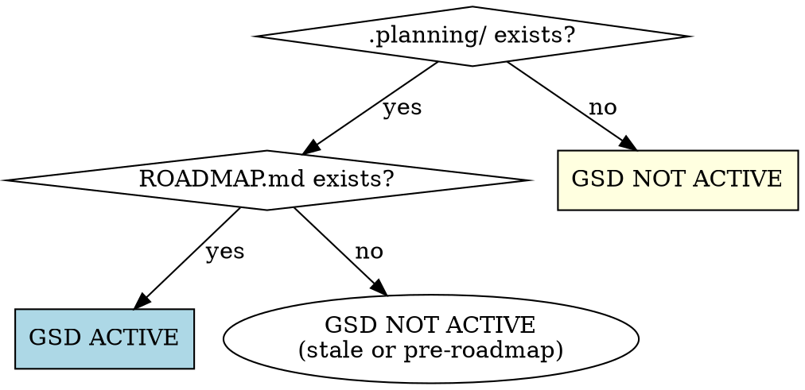
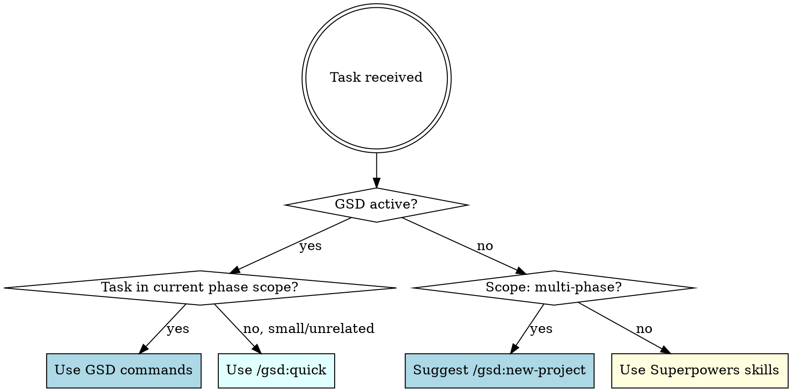
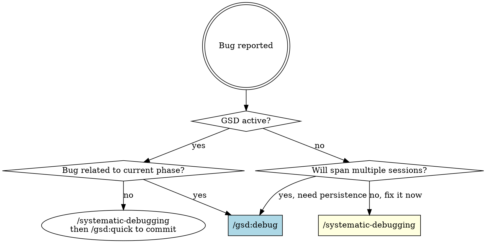
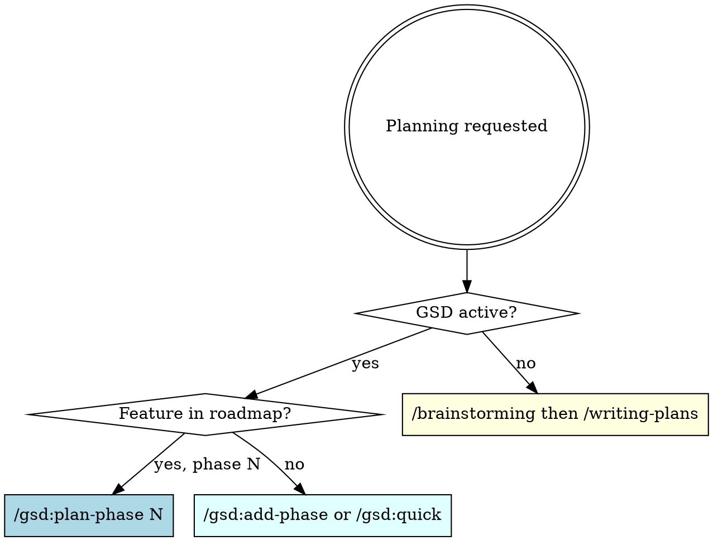

# Workflow Routing: Superpowers + GSD

**Announce at start:** "Workflow Routing skill activated."

Route every task to the right toolchain. Superpowers handles **task-level quality** (TDD, debugging, design, review). GSD handles **project-level orchestration** (phases, milestones, persistent state). They are complementary — never competing.

<HARD-GATE>
Check routing BEFORE invoking any other skill or GSD command. This skill fires first.
</HARD-GATE>

## Detection: Is GSD Active?

Check the current working directory:



**GSD active signals:** `.planning/PROJECT.md`, `.planning/ROADMAP.md`, `.planning/STATE.md` all present.

## Primary Routing Decision



## Scope Signals

| Signal | Indicates | Route |
|--------|-----------|-------|
| "build app", "create platform", "new project", "implement system" | Multi-phase | GSD |
| "phase", "milestone", "roadmap", "epic", "release" | Multi-phase | GSD |
| 6+ features, 2+ weeks, architectural decisions needed | Multi-phase | GSD |
| "fix bug", "add button", "update function", "refactor method" | Single-session | Superpowers |
| "quick fix", "hotfix", "one more thing" | Small/ad-hoc | Superpowers or `/gsd:quick` if GSD active |
| Unknown scope, user unsure | Undetermined | `/brainstorming` first to scope, then decide |

## Combined Workflows

### Multi-Phase Project (GSD + Superpowers for Quality)

```
/brainstorming                    ← Superpowers: design before planning
  ↓
/gsd:new-project                  ← GSD: project structure + roadmap
  ↓
/gsd:plan-phase N                 ← GSD: detailed phase plan
  ↓
/gsd:execute-phase N              ← GSD: runs tasks with atomic commits
  ├── /systematic-debugging       ← Superpowers: if bug during execution
  └── /test-driven-development    ← Superpowers: TDD within each task
  ↓
/requesting-code-review           ← Superpowers: review before moving on
  ↓
/gsd:verify-work N                ← GSD: UAT validation
  ↓
/verification-before-completion   ← Superpowers: evidence-based "done"
  ↓
/gsd:progress                     ← GSD: route to next phase
```

### Single-Session Task (Superpowers Only)

```
/brainstorming                    ← Explore intent, produce spec
  ↓
/writing-plans                    ← Break into TDD tasks
  ↓
/executing-plans                  ← Run tasks sequentially
  OR /subagent-driven-development ← Run tasks via parallel subagents
  ├── /systematic-debugging       ← If issues arise
  └── /test-driven-development    ← TDD per task
  ↓
/requesting-code-review           ← Review before done
  ↓
/verification-before-completion   ← Prove it works
  ↓
/finishing-a-development-branch   ← Merge, PR, or cleanup
```

## Edge Case Decision Trees

### "Debug this" — Which Tool?



### "Plan this" — Which Tool?



### Scope Escalation (Superpowers → GSD)

During `/brainstorming`, if scope grows beyond single-session:

```
Detection:
  - 5+ independent subsystems identified
  - 2+ weeks estimated work
  - Multiple architectural decisions needed
  - User says "this is bigger than I thought"

Action:
  "This needs GSD's phase structure for persistence across sessions.
   Ready to initialize /gsd:new-project with the spec we just brainstormed?"

  → Convert brainstorming output into GSD project input
  → User confirms escalation
```

### User Picks Wrong Tool

**User wants Superpowers for a large project:**
> "This sounds like it needs 5+ phases and multiple sessions. GSD would give you persistent state and milestone tracking. Want to use `/gsd:new-project` instead?"

**User wants GSD for a tiny task:**
> "This is small enough for a single session — GSD's ceremony would slow us down. Let's use `/brainstorming` → `/writing-plans` → `/executing-plans` instead."

**Always respect the user's final choice.** Suggest, don't force.

## Universal Rules (Both Toolchains)

1. **Always `/brainstorming` before creative work** — regardless of GSD or Superpowers
2. **Always `/verification-before-completion` before claiming done** — no exceptions
3. **Always `/requesting-code-review` after significant implementation** — works in both contexts
4. **Always `/test-driven-development` when writing code** — embedded discipline, not optional
5. **Always `/systematic-debugging` before proposing fixes** — root cause first

## Quick Reference: Command Mapping

| Task | GSD Active | No GSD |
|------|-----------|--------|
| Design a feature | `/brainstorming` → `/gsd:plan-phase` | `/brainstorming` → `/writing-plans` |
| Execute a plan | `/gsd:execute-phase N` | `/executing-plans` or `/subagent-driven-development` |
| Fix a bug (small) | `/gsd:quick` | `/systematic-debugging` |
| Fix a bug (complex) | `/gsd:debug` | `/systematic-debugging` |
| Review code | `/requesting-code-review` | `/requesting-code-review` |
| Verify work | `/gsd:verify-work N` | `/verification-before-completion` |
| Check progress | `/gsd:progress` | N/A (session-scoped) |
| Resume paused work | `/gsd:resume-work` | Re-read plan file |
| Ad-hoc task | `/gsd:quick` | Direct Superpowers workflow |
| Start new project | `/gsd:new-project` | `/brainstorming` → `/writing-plans` |

## Red Flags — You're Routing Wrong

| Symptom | Problem | Fix |
|---------|---------|-----|
| Using `/writing-plans` when `.planning/` exists | Bypassing GSD's plan structure | Use `/gsd:plan-phase` instead |
| Using `/gsd:new-project` for a 1-hour task | Overkill, ceremony slows you down | Use Superpowers workflow |
| Skipping `/brainstorming` because "it's obvious" | Hidden assumptions will bite you | Brainstorm first, always |
| Fixing bugs without `/systematic-debugging` | Guessing instead of investigating | Root cause first |
| Claiming "done" without verification evidence | No proof = no done | Run `/verification-before-completion` |
| Using Superpowers for multi-week work | Context lost between sessions | Escalate to GSD |
| Ignoring stale GSD project in directory | `.planning/` exists for a reason | Run `/gsd:progress` to check state |
